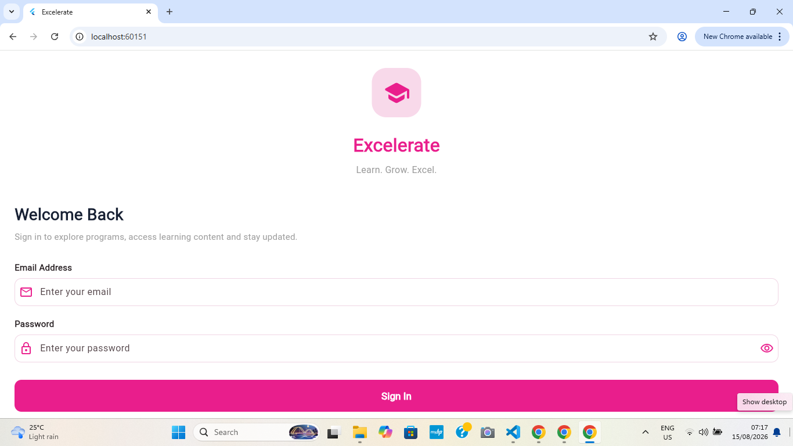
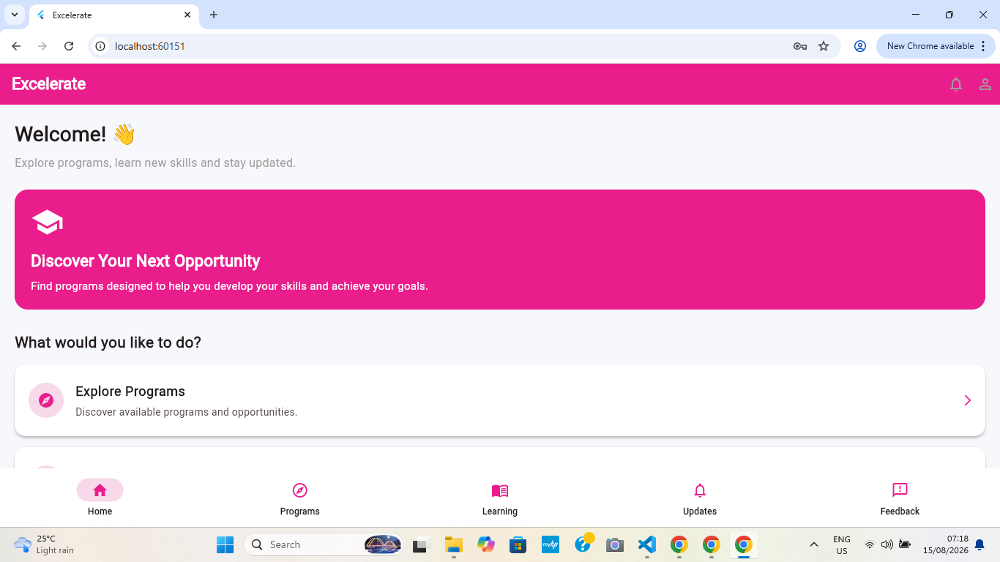
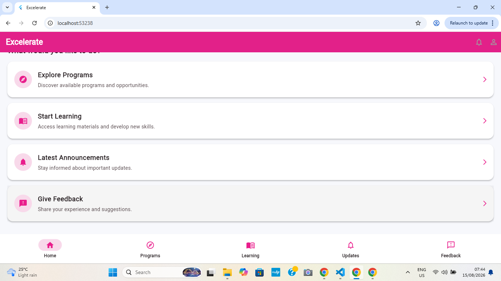
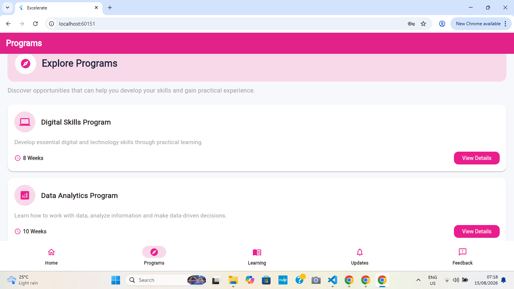
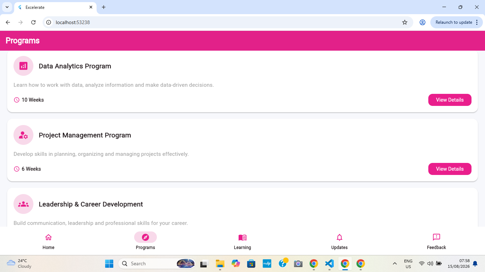
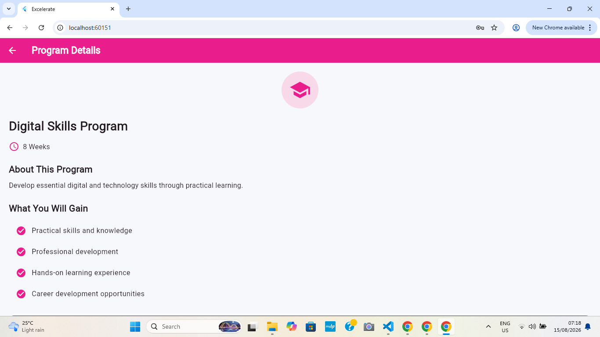
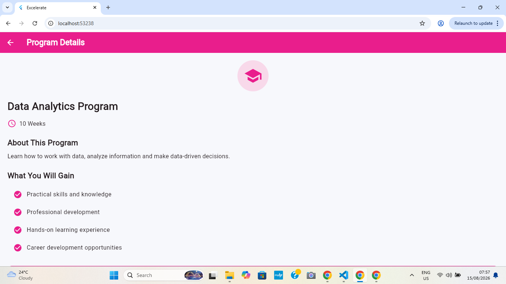
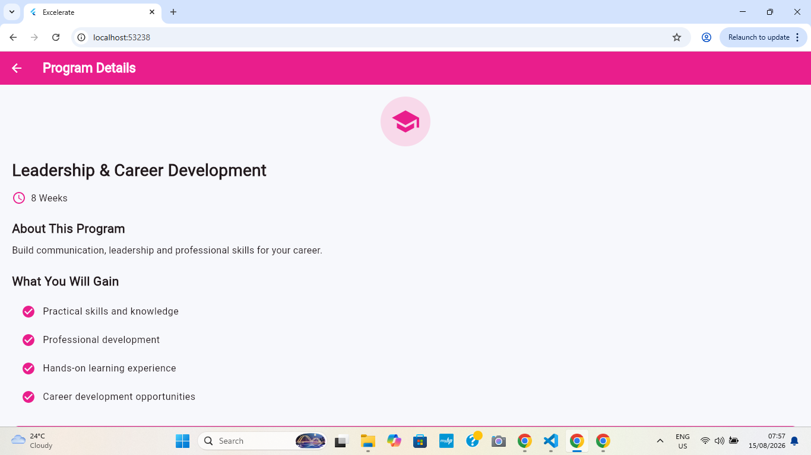

## Week 2 Screenshots

### 1. Login Screen

### 2. Home Screen

### 3. Program Listing Screen

### 4. Program Details Screen

## Week 3 Update – Excelerate Learning App

What Changed

- Connected the Programs screen to program data stored in "assets/programs.json".
- Program information such as title, description, icon, and duration is now loaded dynamically.
- Added a functional Feedback form.
- Added validation to the Feedback form for rating and feedback text.
- Added error handling and a Try Again option when program data cannot be loaded.

Week 3 Learning Outcomes

- Connected a Flutter application to JSON data.
- Implemented user input and form validation.
- Added loading and error handling.
- Updated and pushed the project to GitHub.
